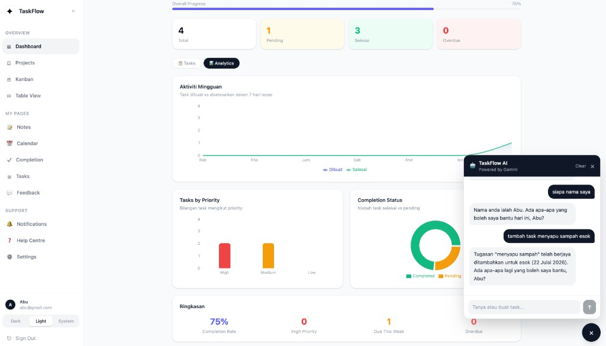

# ✦ TaskFlow

A full-stack task management application with a clean minimal UI, AI-powered chatbot, dark mode, real-time notifications, and production-grade security.

LIVE: https://taskflow-api-production-66fc.up.railway.app

## Preview



*AI chatbot — ask in Malay or English to manage your tasks hands-free*

## Features

- JWT auth with **refresh token rotation** (httpOnly cookie, 15-min access token)
- Task CRUD — inline edit, due date, overdue state, priority, completion toggle
- Kanban board (drag & drop), calendar view, table view
- Notes editor (TipTap + slash commands)
- Projects, Feedback, Notifications
- File attachments (image / PDF, 5MB limit)
- Analytics charts (Recharts)
- Light / Dark / System theme toggle
- Paginated task & notification lists
- **AI Chatbot** — powered by Google Gemini, supports natural language task management

## Tech Stack

### Frontend (`client-server`)

| Package | Purpose |
|---------|---------|
| React 19 + Vite 8 | UI framework + build tool |
| React Router v6 | URL-based routing |
| Tailwind CSS 4 | Styling |
| TipTap | Rich text notes editor |
| Recharts | Analytics charts |
| dnd-kit | Kanban drag & drop |
| TanStack Table | Table view |

### Backend (`server`)

| Package | Purpose |
|---------|---------|
| Express 5 | HTTP server |
| MySQL (`mysql2`) | Database |
| `jsonwebtoken` | Access token signing |
| `bcryptjs` | Password hashing |
| `multer` | File upload |
| `helmet` | HTTP security headers |
| `express-rate-limit` | Rate limiting |
| `joi` | Input validation |
| `morgan` | Request logging |
| `cookie-parser` | httpOnly cookie parsing |
| `@google/generative-ai` | Gemini AI function calling |

## Project Structure

```
TaskFlow API/
├── client-server/                  # React frontend
│   └── src/
│       ├── components/             # Sidebar, ChatBot, Editor, Attachments
│       ├── hooks/                  # useAuthGuard, useIdleTimeout, useTheme, useDebounce
│       ├── pages/                  # Dashboard, Kanban, Projects ...
│       └── services/
│           └── api.js              # fetchWithAuth interceptor (auto token refresh)
│
└── server/                         # Express API
    └── src/
        ├── config/
        │   ├── database.js
        │   └── migration.sql       # Full DB schema
        ├── controllers/
        │   ├── authController.js   # register, login, refresh, logout
        │   └── taskController.js
        ├── middleware/
        │   ├── authMiddleware.js   # JWT verification
        │   ├── errorHandler.js     # Global error handler
        │   ├── rateLimiter.js      # Auth + API limiters
        │   └── validate.js         # Joi validation factory
        ├── routes/                 # authRoutes, taskRoutes, projectRoutes, aiRoutes ...
        └── services/               # projectService, feedbackService, notificationService, aiService
```

## Setup

### 1. Clone

```bash
git clone <your-repo-url>
cd "TaskFlow API"
```

### 2. Database

```bash
mysql -u root -p < server/src/config/migration.sql
```

This creates the `taskflow_db` database and all tables:
`users`, `tasks`, `projects`, `workspaces`, `workspace_members`, `feedback`, `notifications`, `task_attachments`, `refresh_tokens`

### 3. Backend

```bash
cd server
npm install
```

Copy `.env.example` and fill in your values:

```bash
cp .env.example .env
```

```env
PORT=3001
NODE_ENV=development

DB_HOST=localhost
DB_PORT=3306
DB_USER=root
DB_PASSWORD=your_password
DB_NAME=taskflow_db

JWT_SECRET=your_super_secret_key_min_32_chars
JWT_EXPIRES_IN=15m

ALLOWED_ORIGIN=http://localhost:5173

GEMINI_API_KEY=your_gemini_api_key_here
```

> Get your free Gemini API key at [aistudio.google.com/app/apikey](https://aistudio.google.com/app/apikey). Create the key in a new project to ensure free tier access.

Start the server:

```bash
npm run dev
```

### 4. Frontend

```bash
cd client-server
npm install
npm run dev
```

| URL | Default |
|-----|---------|
| Frontend | `http://localhost:5173` |
| Backend | `http://localhost:3001` |

## API Reference

### Auth

| Method | Endpoint | Auth | Description |
|--------|----------|------|-------------|
| POST | `/api/auth/register` | — | Register user |
| POST | `/api/auth/login` | — | Login — returns access token, sets refresh cookie |
| POST | `/api/auth/refresh` | cookie | Issue new access token (rotates refresh token) |
| POST | `/api/auth/logout` | cookie | Invalidate refresh token + clear cookie |

### Tasks

| Method | Endpoint | Description |
|--------|----------|-------------|
| GET | `/api/tasks?page=1&limit=20&status=pending` | List tasks (paginated) |
| POST | `/api/tasks` | Create task |
| PUT | `/api/tasks/:id` | Update task |
| DELETE | `/api/tasks/:id` | Delete task |

### AI Chatbot

| Method | Endpoint | Description |
|--------|----------|-------------|
| POST | `/api/ai/chat` | Send message to AI assistant |

**Request body:**
```json
{
  "message": "tambah task meeting dengan client esok priority high",
  "history": []
}
```

**AI capabilities:** list tasks, create task, update task, delete task, list projects — all via natural language in Malay or English.

### Other endpoints

| Prefix | Methods | Description |
|--------|---------|-------------|
| `/api/projects` | GET, POST, DELETE | Project management |
| `/api/feedback` | GET, POST, DELETE | Task feedback |
| `/api/notifications?page=1&limit=20` | GET, PATCH, DELETE | Notifications (paginated) |
| `/api/upload/:taskId` | GET, POST, DELETE | File attachments |

> All endpoints except `/api/auth/*` require `Authorization: Bearer <token>` header.

## Security

- **Rate limiting** — auth endpoints: 10 req / 15 min · API: 100 req / 1 min · AI: 15 req / 1 min
- **Helmet** — sets secure HTTP headers automatically
- **Refresh token rotation** — every `/refresh` call issues a new refresh token and invalidates the old one
- **Refresh token storage** — SHA-256 hashed in DB; raw token lives only in httpOnly cookie
- **Input validation** — Joi schemas on all POST/PUT/PATCH endpoints
- **CORS** — restricted to `ALLOWED_ORIGIN` env variable only

## Notes

- Theme preference is stored in `localStorage` via `useTheme` hook.
- Session auto-expires after **30 minutes of inactivity** (`useIdleTimeout`).
- After updating `JWT_EXPIRES_IN` in `.env`, restart the server for the change to take effect.
- If Vite throws a missing dependency error for `recharts`, run `npm install` inside `client-server/`.
- The AI chatbot requires a valid `GEMINI_API_KEY`. Free tier supports up to 1,500 requests/day.
