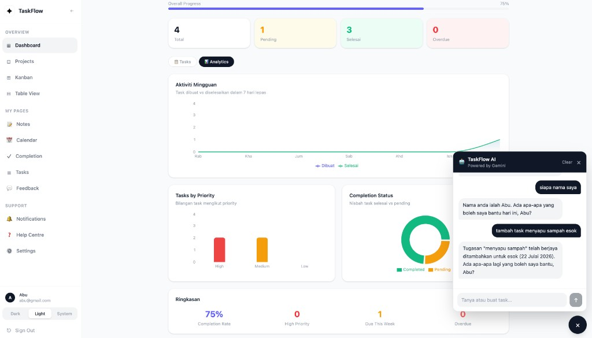

# ✦ TaskFlow

A full-stack personal task management app with Free/Pro plans, Stripe billing, AI chatbot, synced notes, dark mode, real-time notifications, and production-grade security.

UI, API, and AI replies are **English**.

## Documentation

| Doc | What it covers |
|-----|----------------|
| [docs/PRD.md](docs/PRD.md) | Product requirements, plans, user journeys |
| [docs/DESIGN.md](docs/DESIGN.md) | UI layout, color, components, screens |
| [docs/RULES.md](docs/RULES.md) | Product, security, API, and engineering rules |
| [docs/SCHEMA.md](docs/SCHEMA.md) | MySQL tables, enums, client storage |
| [docs/ARCHITECTURE.md](docs/ARCHITECTURE.md) | System design, auth, gates, deploy |

## Preview



*AI chatbot — manage tasks with natural language (replies in English)*

## Plans

| | Free | Pro |
|---|------|-----|
| Tasks | Max 20 | Unlimited |
| Projects | Max 3 | Unlimited |
| List / Kanban / Table / Completed | Yes | Yes |
| AI chatbot | Locked | Included |
| File attachments | Locked | Included |
| Analytics | Locked | Included |
| Calendar | Locked | Included |
| Notes (synced) | Locked | Included |
| Billing | — | Stripe Checkout (subscription) |

Demo unlock (`POST /api/subscription/activate`) only when `ALLOW_MANUAL_UPGRADE=true` (or unset in non-production).

## Features

- JWT auth with **refresh token rotation** (httpOnly cookie, 15-min access token)
- Task CRUD — inline edit, due date, overdue state, priority, completion toggle
- Kanban board (drag & drop), calendar view, table view
- **Notes** — TipTap + slash commands, persisted in MySQL (Pro)
- Projects, Feedback, Settings (name + notification prefs)
- File attachments (image / PDF, 5MB, authenticated download)
- Analytics charts (Recharts, Pro)
- Due-date notifications (overdue / today / tomorrow) + Socket.io push
- Light / Dark / System theme toggle
- **Stripe Checkout** + Customer Portal + webhooks for Pro
- **AI Chatbot** — Google Gemini function calling (Pro, task-scoped)

## Tech Stack

### Frontend (`client-server`)

| Package | Purpose |
|---------|---------|
| React 19 + Vite 8 | UI framework + build tool |
| React Router | URL-based routing |
| Tailwind CSS 4 | Styling |
| Lucide React | Icons |
| TipTap | Rich text notes editor |
| Recharts | Analytics charts |
| dnd-kit | Kanban drag & drop |
| TanStack Table | Table view |
| Socket.io client | Real-time notifications |

### Backend (`server`)

| Package | Purpose |
|---------|---------|
| Express 5 | HTTP server |
| MySQL (`mysql2`) | Database |
| `stripe` | Checkout, Portal, webhooks |
| `jsonwebtoken` | Access token signing |
| `bcryptjs` | Password hashing |
| `multer` | File upload |
| `helmet` | HTTP security headers |
| `express-rate-limit` | Rate limiting |
| `joi` | Input validation |
| `morgan` | Request logging |
| `cookie-parser` | httpOnly cookie parsing |
| `socket.io` | Real-time notifications |
| `@google/generative-ai` | Gemini AI function calling |

## Project Structure

```
TaskFlow API/
├── docs/                           # PRD, design, rules, schema, architecture
├── client-server/                  # React frontend
│   └── src/
│       ├── components/             # Sidebar, ChatBot, Editor, Attachments, UpgradeGate
│       ├── contexts/               # SocketProvider
│       ├── hooks/                  # auth, idle, theme, debounce
│       ├── pages/                  # Dashboard, Kanban, Notes, Pricing, Settings …
│       └── services/api.js         # fetchWithAuth + resource helpers
│
└── server/                         # Express API
    ├── scripts/migrate.js          # Additive migrate for existing DBs
    └── src/
        ├── config/                 # DB, migration.sql, plans, swagger, socket
        ├── controllers/            # auth, tasks
        ├── middleware/             # JWT, Joi, rate limit, requireFeature, errors
        ├── routes/                 # auth, tasks, notes, subscription, stripe webhook …
        ├── services/               # notes, stripe, subscription, AI, notifications …
        └── validators/             # Joi schemas
```

## Setup

### 1. Clone

```bash
git clone <your-repo-url>
cd "TaskFlow API"
```

### 2. Database

```bash
# Fresh install
mysql -u root -p < server/src/config/migration.sql

# Or for an existing DB (additive columns / tables)
cd server && npm run migrate
```

Active tables include: `users`, `tasks`, `projects`, `feedback`, `notifications`, `task_attachments`, `notes`, `refresh_tokens`, `password_resets`.  
`workspaces` / `workspace_members` are leftover schema and are not used by the product.

### 3. Backend

```bash
cd server
npm install
cp .env.example .env
```

Minimum `.env`:

```env
PORT=3001
NODE_ENV=development

DB_HOST=localhost
DB_PORT=3306
DB_USER=root
DB_PASSWORD=your_password
DB_NAME=taskflow_db

JWT_SECRET=your_super_secret_key_min_32_chars
JWT_EXPIRES_IN=15m

ALLOWED_ORIGIN=http://localhost:5173

GEMINI_API_KEY=your_gemini_api_key_here
ALLOW_MANUAL_UPGRADE=false
```

Stripe (test mode) for paid Pro:

```env
STRIPE_SECRET_KEY=sk_test_...
STRIPE_WEBHOOK_SECRET=whsec_...
STRIPE_PRICE_ID=price_...
STRIPE_PRO_PRICE_LABEL=RM 19.99/mo
```

> Gemini key: [aistudio.google.com/app/apikey](https://aistudio.google.com/app/apikey)  
> Stripe test keys + Price ID: [dashboard.stripe.com](https://dashboard.stripe.com) (Test mode)

```bash
npm run migrate   # recommended once after pull
npm run dev
```

Local webhooks (separate terminal):

```bash
stripe listen --forward-to localhost:3001/api/subscription/webhook \
  --events checkout.session.completed,customer.subscription.updated,customer.subscription.deleted
```

Copy the printed `whsec_…` into `STRIPE_WEBHOOK_SECRET`, then restart the API.

### 4. Frontend

```bash
cd client-server
npm install
npm run dev
```

| URL | Default |
|-----|---------|
| Frontend | `http://localhost:5173` |
| Backend | `http://localhost:3001` |
| API docs | `http://localhost:3001/api/docs` |

## API Reference

Interactive Swagger UI: `/api/docs`.

### Auth

| Method | Endpoint | Auth | Description |
|--------|----------|------|-------------|
| POST | `/api/auth/register` | — | Register user |
| POST | `/api/auth/login` | — | Access token + refresh cookie |
| POST | `/api/auth/refresh` | cookie | Rotate refresh, new access token |
| POST | `/api/auth/logout` | cookie | Invalidate refresh |
| POST | `/api/auth/forgot-password` | — | Request reset |
| POST | `/api/auth/reset-password` | — | Reset with token |
| GET | `/api/auth/me` | Bearer | Profile + notification prefs |
| PATCH | `/api/auth/me` | Bearer | Update name / prefs |

### Tasks

| Method | Endpoint | Description |
|--------|----------|-------------|
| GET | `/api/tasks?page=1&limit=20&status=pending` | List tasks (paginated) |
| POST | `/api/tasks` | Create task (Free capped at 20) |
| PUT | `/api/tasks/:id` | Update task |
| DELETE | `/api/tasks/:id` | Delete task |

### Notes (Pro)

| Method | Endpoint | Description |
|--------|----------|-------------|
| GET | `/api/notes` | List notes |
| POST | `/api/notes` | Create note |
| PATCH | `/api/notes/:id` | Update title / emoji / content |
| DELETE | `/api/notes/:id` | Delete note |

### Subscription / Stripe

| Method | Endpoint | Description |
|--------|----------|-------------|
| GET | `/api/subscription` | Plan, limits, usage, features |
| POST | `/api/subscription/checkout` | Create Stripe Checkout session |
| POST | `/api/subscription/portal` | Open Customer Portal |
| POST | `/api/subscription/webhook` | Stripe webhooks (raw body, signature) |
| POST | `/api/subscription/activate` | Demo Pro (env-gated) |

### AI Chatbot (Pro)

| Method | Endpoint | Description |
|--------|----------|-------------|
| POST | `/api/ai/chat` | Natural-language task ops (15 req/min) |

Tools: list/create/update/delete tasks, list projects. Off-topic requests are refused. Replies are always English.

### Other

| Prefix | Methods | Description |
|--------|---------|-------------|
| `/api/projects` | GET, POST, DELETE | Projects (Free capped at 3) |
| `/api/feedback` | GET, POST, DELETE | Task feedback |
| `/api/notifications` | GET, PATCH, DELETE | Notifications |
| `/api/upload` | GET, POST, DELETE | Attachments (Pro upload; auth download) |

> All endpoints except `/api/auth/*` (and the Stripe webhook) require `Authorization: Bearer <token>`.

## Security

- **Rate limiting** — auth: 10 / 15 min · API: 100 / 1 min · AI: 15 / 1 min
- **Helmet** — secure HTTP headers
- **Refresh token rotation** — each refresh invalidates the previous hash
- **Refresh storage** — SHA-256 in DB; raw token only in httpOnly cookie
- **Plan gates** — `requireFeature` + task/project caps; AI/upload cannot bypass Free limits
- **Input validation** — Joi on POST/PUT/PATCH
- **CORS** — `ALLOWED_ORIGIN` only; credentials enabled
- **Uploads** — MIME allowlist, 5MB max, owner check, no public static `/uploads`

## Notes

- Theme preference is stored in `localStorage` via `useTheme`.
- Notes sync via `/api/notes`. On first load, any old `notion_pages` cache is imported once then removed.
- Session ends after **30 minutes** of inactivity (`useIdleTimeout`).
- After changing `.env`, restart the API (`nodemon` does not always reload env).
- Stripe: keep `ALLOW_MANUAL_UPGRADE=false` in production; use test cards (`4242…`) in Test mode.
- Gemini requires a valid `GEMINI_API_KEY`.
