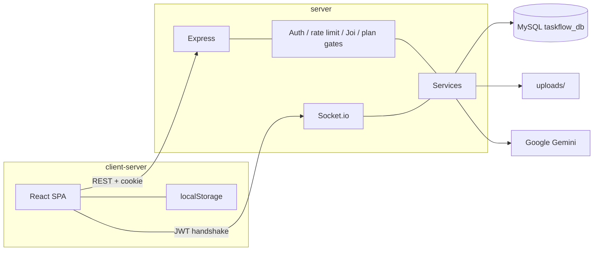
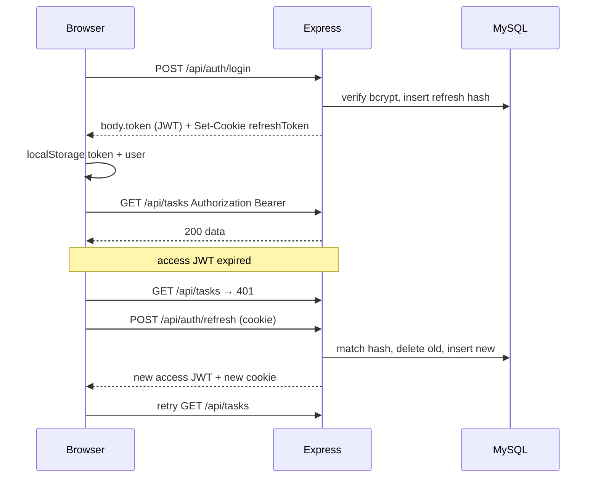

# TaskFlow — Architecture

System architecture for the TaskFlow API and React client. Related: [PRD.md](./PRD.md) · [DESIGN.md](./DESIGN.md) · [RULES.md](./RULES.md) · [SCHEMA.md](./SCHEMA.md).

---

## 1. Overview

TaskFlow is a **two-process** application:

| Process | Stack | Default URL |
|---------|--------|-------------|
| API + Socket.io | Node.js ≥ 20, Express 5, MySQL, Socket.io | `http://localhost:3001` |
| SPA | React 19, Vite 8, Tailwind CSS 4 | `http://localhost:5173` |

The browser never talks to MySQL. All durable data (except notes/theme) goes through REST. Realtime notifications use Socket.io on the **same** HTTP server as Express.



## 2. Repository layout

```
TaskFlow API/
├── docs/                      # This documentation set
├── client-server/             # Vite React app
│   └── src/
│       ├── App.jsx            # Routes, session, plan snapshot
│       ├── components/        # Sidebar, ChatBot, Editor, Attachments, UpgradeGate
│       ├── contexts/          # SocketProvider
│       ├── hooks/             # auth, idle, theme, debounce
│       ├── pages/             # One file per route
│       └── services/api.js    # fetchWithAuth + resource helpers
└── server/
    ├── scripts/migrate.js
    ├── uploads/               # Multer destination (gitignored)
    └── src/
        ├── index.js           # HTTP + Socket bootstrap
        ├── config/            # DB pool, SQL, plans, swagger, socket
        ├── controllers/       # auth, tasks
        ├── middleware/        # JWT, validate, rate limit, requireFeature, errors
        ├── routes/            # One router per resource
        ├── services/          # projects, feedback, notifications, AI, subscription
        └── validators/        # Joi schemas
```

Leftover: `server/src/validators/team.validators.js` is unused. Ignore it for new work.

## 3. Runtime bootstrap (API)

`server/src/index.js`:

1. Load `dotenv`.
2. Create `http.Server` wrapping Express; `initSocket(httpServer)`.
3. Helmet (CSP allows Swagger inline script + validator images).
4. CORS with credentials; origin allowlist from `ALLOWED_ORIGIN`.
5. Morgan, `express.json()`, cookie-parser.
6. `apiLimiter` on `/api`.
7. Mount routers (auth, tasks, projects, feedback, upload, notifications, AI, subscription).
8. Swagger UI at `/api/docs`.
9. `errorHandler` last.
10. `testConnection()` then `listen(PORT)`.

Production start: migrate, then this file.

## 4. Request pipeline

```text
Client
  → CORS + Helmet + Morgan
  → cookie-parser + JSON
  → /api rate limit (100/min)
  → router
       → authLimiter (auth routes only)
       → Joi validate (mutating routes)
       → authMiddleware (Bearer JWT)
       → requireFeature (AI chat, upload POST)
       → controller / service
  → errorHandler
```

### Auth middleware

`Authorization: Bearer <jwt>` → `req.user = { id, email, iat, exp }`.

### Feature middleware

`requireFeature("ai")` loads `users.plan`, looks up `PLANS[plan].features[ai]`. False → 403 `UPGRADE_REQUIRED`.

### Plan limits

`assertCanCreateTask` / `assertCanCreateProject` count rows then compare to `maxTasks` / `maxProjects`.

## 5. Authentication architecture



- Access JWT: short-lived (env `JWT_EXPIRES_IN`, code fallback `15m`). Stored in `localStorage.token` so Socket.io and `Authorization` can read it.
- Refresh: httpOnly cookie, rotated, hashed at rest, one row per user.
- SPA also expires the session after 30 minutes idle (`useIdleTimeout`).
- `useAuthGuard` treats a JWT past `exp` as logged out (until refresh runs on the next API call — if the token is already expired locally, the user is sent to login). Coordinate changes to idle vs JWT lifetime carefully.

## 6. Frontend architecture

### 6.1 Routing

`App.jsx`:

- Public: `/login`, `/register`, `/forgot-password`, `/reset-password`.
- Protected (`ProtectedRoute`): everything else under `AppLayout` (sidebar + `<Outlet />` + ChatBot).
- Unknown paths → dashboard or login by auth state.

Pro wrappers: `/notes` and `/calendar` use `ProFeature`. Analytics is gated inside Dashboard. ChatBot and Attachments gate themselves.

### 6.2 State

There is **no Redux**. Session and tasks live in `App` React state. Child pages receive `tasks` / `setTasks` / `user`.

On login, `getSubscription()` hydrates `plan`, `features`, `limits`, `usage`, `manualUpgrade` onto `user`.

### 6.3 API client

`client-server/src/services/api.js`:

- Base URL: `import.meta.env.VITE_API_URL` or `http://localhost:3001/api`.
- `credentials: "include"` for refresh cookie.
- Single-flight refresh queue to avoid stampedes on 401.

### 6.4 Realtime

`SocketProvider` connects to the API origin (not `/api`) with `auth: { token }`. Listens for `new_notification` and increments unread count.

## 7. Domain modules (API)

| Prefix | Auth | Extra gate | Responsibility |
|--------|------|------------|----------------|
| `/api/auth` | No (cookie on refresh/logout) | Auth rate limit | Register, login, refresh, logout, password reset |
| `/api/tasks` | Bearer | Create: plan limit | CRUD + pagination |
| `/api/projects` | Bearer | Create: plan limit | List/create/delete |
| `/api/feedback` | Bearer | — | List/create/delete |
| `/api/upload` | Bearer | POST: `attachments`; GET file: owner check | Multer + attachment rows + authenticated download |
| `/api/notifications` | Bearer | — | List, read, delete |
| `/api/ai` | Bearer | `ai` + 15/min | Gemini function calling |
| `/api/subscription` | Bearer | activate: env flag | Snapshot + demo Pro |
| `/api/docs` | No | — | Swagger UI |

## 8. AI architecture

```text
POST /api/ai/chat { message, history }
  → requireFeature("ai")
  → Gemini gemini-3.5-flash + TOOLS
  → while functionCalls:
        executeTool(userId, name, args)  // SQL scoped by userId
  → { reply, actions }
```

Tools run **as the authenticated user**. Update/delete check `id AND user_id`. Create goes through Joi validators, plan limits, and a per-user row lock.

System instruction: TaskFlow-only scope; always English.

## 9. Notifications architecture

`createNotification(userId, type, title, message, data)`:

1. INSERT row.
2. `getIO().to("user:" + userId).emit("new_notification", row)`.

Socket server verifies JWT, then `socket.join("user:" + decoded.id)`.

Team/workspace emitters were removed with collaboration; keep this helper for any future in-app events (due reminders, etc.).

## 10. Subscription architecture

```text
users.plan  ──►  PLANS[plan]  ──►  features + limits
                     ▲
                     │
            GET /subscription (counts usage)
            POST /subscription/activate (setPlan pro)
```

Stripe customer/subscription IDs are unused. When billing lands, `setPlan` should be driven by webhooks, not a public activate route.

Frontend lock layers:

| Layer | Mechanism |
|-------|-----------|
| Route | `ProFeature` (calendar, notes) |
| Widget | ChatBot, Attachments `locked`, Dashboard analytics tab |
| API | `requireFeature`, `assertCanCreate*` |

UI-only gates (calendar, notes, analytics) have **no** matching REST resource. A Free user who bypasses the SPA still cannot upload or chat without a Pro plan.

## 11. Data stores

| Store | What |
|-------|------|
| MySQL | Users, tasks, projects, feedback, notifications, tokens, attachments metadata |
| Disk | Uploaded binaries |
| localStorage | Access JWT, user snapshot, theme, notes |
| Memory | Socket.io rooms, Express rate-limit counters (per process) |

See [SCHEMA.md](./SCHEMA.md) for tables.

## 12. Security architecture

| Control | Implementation |
|---------|----------------|
| Transport | HTTPS in production (Railway); `secure` cookies when `NODE_ENV=production` |
| Headers | Helmet |
| CORS | Allowlist + credentials |
| Passwords | bcrypt cost 10 |
| Refresh | Hash + rotation + httpOnly |
| Injection | Parameterized SQL; Joi; multer MIME allowlist |
| Abuse | Auth / API / AI rate limits |
| Errors | Generic 500 in production |
| Isolation | `user_id` on every query |

Rate-limit counters are in-process. Multiple Railway replicas would not share them without a store (Redis). Current deploy is typically one Node process.

## 13. Configuration

| Variable | Used by |
|----------|---------|
| `PORT` | HTTP listen (default 3001) |
| `NODE_ENV` | Morgan, cookies, error detail, manual upgrade default |
| `DB_*` | mysql2 pool |
| `JWT_SECRET`, `JWT_EXPIRES_IN` | Access tokens |
| `ALLOWED_ORIGIN` | CORS + Socket.io origin (comma-separated) |
| `GEMINI_API_KEY` | AI |
| `ALLOW_MANUAL_UPGRADE` | Demo Pro activate |
| `VITE_API_URL` | Frontend API base (must include `/api`) |

## 14. Deployment

- **API:** `cd server && npm start` (migrate + listen). Needs MySQL and env vars.
- **Client:** `cd client-server && npm run build`; host the `dist/` static files; set `VITE_API_URL` at build time.
- **Docs:** Swagger at `{API}/api/docs`.

Local dev: two terminals (`server` nodemon, `client-server` Vite). Vite does not proxy by default; the client calls the API origin directly.

## 15. Extension points

When adding a feature:

1. Decide Free vs Pro → `plans.js` (+ UI gate and/or `requireFeature`).
2. If durable: table in `migration.sql` **and** an ALTER in `migrate.js` for existing DBs.
3. Router + Joi + service; mount in `index.js`; Swagger JSDoc.
4. `api.js` helper + page/component matching DESIGN.md.
5. Update PRD / RULES / SCHEMA / this file if behavior is user-visible.
