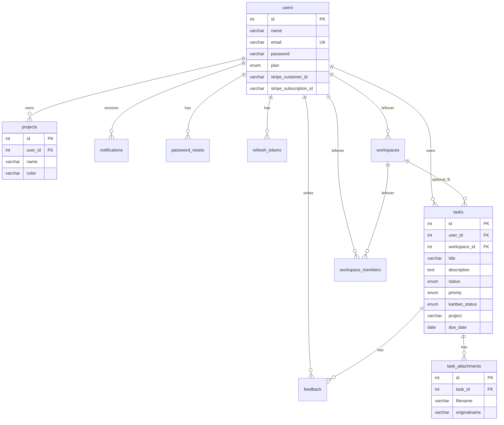

# TaskFlow — Schema

MySQL schema as defined in `server/src/config/migration.sql`, plus client-only stores. Source of truth for new environments: run that SQL (or `npm run migrate` in `server/`).

Related: [PRD.md](./PRD.md) · [RULES.md](./RULES.md) · [ARCHITECTURE.md](./ARCHITECTURE.md)

---

## 1. Database

- Engine: MySQL 8 compatible (`mysql2` pool, 10 connections).
- Database name: `taskflow_db` (override with `DB_NAME`).
- Charset: server default (prefer `utf8mb4` in production).

## 2. Entity relationship



`tasks.project` is **not** an FK to `projects.name`. Projects and the task’s project label can diverge.

## 3. Tables (active)

### 3.1 `users`

| Column | Type | Notes |
|--------|------|--------|
| id | INT PK AI | |
| name | VARCHAR(100) NOT NULL | |
| email | VARCHAR(150) NOT NULL UNIQUE | Login identity |
| password | VARCHAR(255) NOT NULL | bcrypt hash |
| plan | ENUM('free','pro') NOT NULL DEFAULT 'free' | Billing/feature plan |
| stripe_customer_id | VARCHAR(255) NULL | Placeholder |
| stripe_subscription_id | VARCHAR(255) NULL | Placeholder |
| created_at | TIMESTAMP | Default current |
| updated_at | TIMESTAMP | ON UPDATE current |

New users start on **free**. Feature matrix is not stored here; see `plans.js`.

### 3.2 `projects`

| Column | Type | Notes |
|--------|------|--------|
| id | INT PK AI | |
| user_id | INT NOT NULL FK → users.id CASCADE | |
| name | VARCHAR(100) NOT NULL | |
| color | VARCHAR(20) DEFAULT '#6366f1' | Hex |
| created_at | TIMESTAMP | |

### 3.3 `tasks`

| Column | Type | Notes |
|--------|------|--------|
| id | INT PK AI | |
| user_id | INT NOT NULL FK → users.id CASCADE | |
| workspace_id | INT NULL FK → workspaces.id SET NULL | Unused by product |
| title | VARCHAR(255) NOT NULL | |
| description | TEXT | |
| status | ENUM('pending','completed') DEFAULT 'pending' | List/complete |
| priority | ENUM('low','medium','high') DEFAULT 'medium' | |
| kanban_status | ENUM('todo','inprogress','done') DEFAULT 'todo' | Board column |
| project | VARCHAR(100) NULL | Label, not FK |
| due_date | DATE | Calendar uses this |
| created_at | TIMESTAMP | |
| updated_at | TIMESTAMP ON UPDATE | |

`status` and `kanban_status` are independent. Completing a task from the list does not automatically set `kanban_status` to `done` unless the client sends both.

### 3.4 `feedback`

| Column | Type | Notes |
|--------|------|--------|
| id | INT PK AI | |
| task_id | INT NOT NULL FK → tasks.id CASCADE | |
| user_id | INT NOT NULL FK → users.id CASCADE | |
| message | TEXT NOT NULL | App max 2000 via Joi |
| created_at | TIMESTAMP | |

### 3.5 `notifications`

| Column | Type | Notes |
|--------|------|--------|
| id | INT PK AI | |
| user_id | INT NOT NULL FK → users.id CASCADE | |
| type | VARCHAR(50) NOT NULL | |
| title | VARCHAR(255) NOT NULL | |
| message | TEXT | |
| data | JSON | Optional payload |
| is_read | TINYINT(1) DEFAULT 0 | |
| created_at | TIMESTAMP | |

### 3.6 `password_resets`

| Column | Type | Notes |
|--------|------|--------|
| id | INT PK AI | |
| user_id | INT NOT NULL FK → users.id CASCADE | |
| token_hash | VARCHAR(64) NOT NULL UNIQUE | SHA-256 hex |
| expires_at | DATETIME NOT NULL | |
| created_at | TIMESTAMP | |

Index: `idx_user_id`.

### 3.7 `refresh_tokens`

| Column | Type | Notes |
|--------|------|--------|
| id | INT PK AI | |
| user_id | INT NOT NULL FK → users.id CASCADE | |
| token_hash | VARCHAR(64) NOT NULL UNIQUE | SHA-256 of cookie value |
| expires_at | DATETIME NOT NULL | Typically +7 days |
| created_at | TIMESTAMP | |

Index: `idx_user_id`. Login deletes all rows for the user (one session).

### 3.8 `task_attachments`

| Column | Type | Notes |
|--------|------|--------|
| id | INT PK AI | |
| task_id | INT NOT NULL FK → tasks.id CASCADE | |
| filename | VARCHAR(255) NOT NULL | Stored name on disk |
| originalname | VARCHAR(255) NOT NULL | User filename |
| mimetype | VARCHAR(100) NOT NULL | |
| size | INT NOT NULL | Bytes |
| created_at | TIMESTAMP | |

Binary files live in `server/uploads/{filename}`, not in MySQL.

## 4. Tables (leftover — do not use in new features)

Kept so existing databases migrate without DROP. Product UI and routes must not depend on them.

### 4.1 `workspaces`

| Column | Type |
|--------|------|
| id | INT PK AI |
| owner_id | INT NOT NULL FK → users.id CASCADE |
| name | VARCHAR(100) NOT NULL DEFAULT 'My Workspace' |
| created_at | TIMESTAMP |

### 4.2 `workspace_members`

| Column | Type |
|--------|------|
| id | INT PK AI |
| workspace_id | INT NOT NULL FK → workspaces.id CASCADE |
| user_id | INT NOT NULL FK → users.id CASCADE |
| role | ENUM('owner','admin','member','viewer') DEFAULT 'member' |
| status | ENUM('pending','accepted') DEFAULT 'pending' |
| joined_at | TIMESTAMP |

Unique `(workspace_id, user_id)`.

## 5. Enums (quick reference)

| Enum | Values |
|------|--------|
| users.plan | free, pro |
| tasks.status | pending, completed |
| tasks.priority | low, medium, high |
| tasks.kanban_status | todo, inprogress, done |
| workspace_members.role | owner, admin, member, viewer |
| workspace_members.status | pending, accepted |

## 6. Plan config (not a table)

`server/src/config/plans.js` is the feature catalog:

```text
free: maxTasks=20, maxProjects=3, all Pro features false
pro:  maxTasks=null, maxProjects=null, all Pro features true
```

Snapshot returned by `GET /api/subscription`:

```json
{
  "plan": "free",
  "planName": "Free",
  "limits": { "maxTasks": 20, "maxProjects": 3 },
  "usage": { "tasks": 4, "projects": 1 },
  "features": {
    "ai": false,
    "attachments": false,
    "analytics": false,
    "calendar": false,
    "notes": false
  },
  "manualUpgrade": true
}
```

`usage.tasks` is `COUNT(*)` of all tasks for the user (including completed). Hitting 20 blocks **create**, not updates.

## 7. Client-only storage

Not in MySQL.

| Key | Shape | Purpose |
|-----|--------|---------|
| `token` | JWT string | Access token |
| `user` | `{ id, name, email, plan, features, limits, usage, … }` | Session + plan snapshot |
| `theme` | `light` \| `dark` \| `system` | Theme |
| `notion_pages` | Array of `{ id, title, emoji, content, updatedAt }` | Notes |

Clear `token` and `user` on logout. Notes persist in the browser after logout unless the user clears site data.

## 8. Migrations

1. **Fresh DB:** `mysql < server/src/config/migration.sql` or `node server/scripts/migrate.js`.
2. **Existing DB:** migrate script runs the SQL file, then:

```sql
ALTER TABLE users ADD COLUMN plan ENUM('free', 'pro') NOT NULL DEFAULT 'free';
ALTER TABLE users ADD COLUMN stripe_customer_id VARCHAR(255) DEFAULT NULL;
ALTER TABLE users ADD COLUMN stripe_subscription_id VARCHAR(255) DEFAULT NULL;
```

Duplicate-column errors (errno 1060) are ignored.

Railway start command: `node scripts/migrate.js && node src/index.js`.

## 9. Integrity notes

- Deleting a user cascades tasks, projects, feedback, notifications, tokens, attachments (via tasks).
- Deleting a task cascades its feedback and attachments; disk files may remain until a cleanup job exists.
- There is no unique constraint on `(user_id, projects.name)`.
- There is no check that `tasks.project` matches a `projects.name`.
