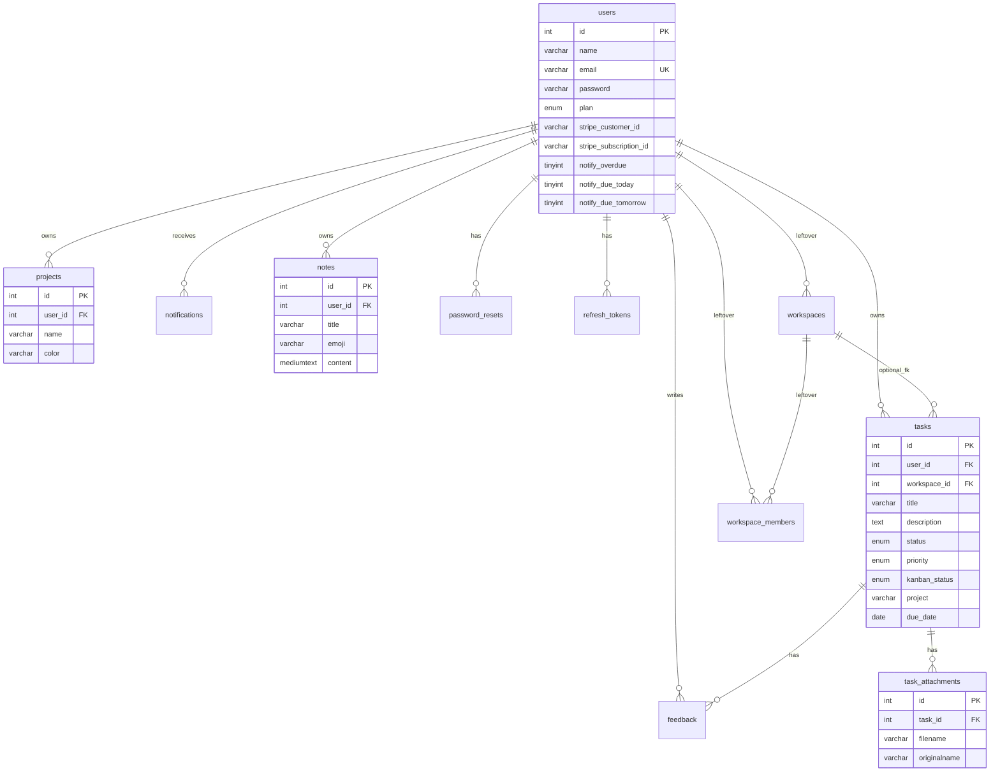

# TaskFlow — Schema

MySQL schema as defined in `server/src/config/migration.sql`, plus client-only stores. Source of truth for new environments: run that SQL (or `npm run migrate` in `server/`).

Related: [PRD.md](./PRD.md) · [RULES.md](./RULES.md) · [ARCHITECTURE.md](./ARCHITECTURE.md)

---

## 1. Database

- Engine: MySQL 8 compatible (`mysql2` pool, 10 connections).
- Database name: `taskflow_db` (override with `DB_NAME`).
- Charset: server default (prefer `utf8mb4` in production — required for note emojis).

## 2. Entity relationship


```mermaid
erDiagram
  users ||--o{ projects : owns
  users ||--o{ tasks : owns
  users ||--o{ feedback : writes
  users ||--o{ notifications : receives
  users ||--o{ notes : owns
  users ||--o{ password_resets : has
  users ||--o{ refresh_tokens : has
  users ||--o{ workspaces : leftover
  users ||--o{ workspace_members : leftover
  tasks ||--o{ feedback : has
  tasks ||--o{ task_attachments : has
  workspaces ||--o{ workspace_members : leftover
  workspaces ||--o{ tasks : optional_fk

  users {
    int id PK
    varchar name
    varchar email UK
    varchar password
    enum plan
    varchar stripe_customer_id
    varchar stripe_subscription_id
    tinyint notify_overdue
    tinyint notify_due_today
    tinyint notify_due_tomorrow
  }
  tasks {
    int id PK
    int user_id FK
    int workspace_id FK
    varchar title
    text description
    enum status
    enum priority
    enum kanban_status
    varchar project
    date due_date
  }
  notes {
    int id PK
    int user_id FK
    varchar title
    varchar emoji
    mediumtext content
  }
  projects {
    int id PK
    int user_id FK
    varchar name
    varchar color
  }
  task_attachments {
    int id PK
    int task_id FK
    varchar filename
    varchar originalname
  }
```

`tasks.project` is **not** an FK to `projects.name`. Projects and the task’s project label can diverge.

## 3. Tables (active)

### 3.1 `users`

| Column | Type | Notes |
|--------|------|--------|
| id | INT PK AI | |
| name | VARCHAR(100) NOT NULL | |
| email | VARCHAR(150) NOT NULL UNIQUE | Login identity |
| password | VARCHAR(255) NOT NULL | bcrypt hash |
| plan | ENUM('free','pro') NOT NULL DEFAULT 'free' | Billing/feature plan |
| stripe_customer_id | VARCHAR(255) NULL | Stripe Customer id |
| stripe_subscription_id | VARCHAR(255) NULL | Stripe Subscription id |
| notify_overdue | TINYINT(1) NOT NULL DEFAULT 1 | Due-date job |
| notify_due_today | TINYINT(1) NOT NULL DEFAULT 1 | Due-date job |
| notify_due_tomorrow | TINYINT(1) NOT NULL DEFAULT 0 | Due-date job |
| created_at | TIMESTAMP | Default current |
| updated_at | TIMESTAMP | ON UPDATE current |

New users start on **free**. Feature matrix is not stored here; see `plans.js`.

### 3.2 `projects`

| Column | Type | Notes |
|--------|------|--------|
| id | INT PK AI | |
| user_id | INT NOT NULL FK → users.id CASCADE | |
| name | VARCHAR(100) NOT NULL | |
| color | VARCHAR(20) DEFAULT '#6366f1' | Hex |
| created_at | TIMESTAMP | |

### 3.3 `tasks`

| Column | Type | Notes |
|--------|------|--------|
| id | INT PK AI | |
| user_id | INT NOT NULL FK → users.id CASCADE | |
| workspace_id | INT NULL FK → workspaces.id SET NULL | Unused by product |
| title | VARCHAR(255) NOT NULL | |
| description | TEXT | |
| status | ENUM('pending','completed') DEFAULT 'pending' | List/complete |
| priority | ENUM('low','medium','high') DEFAULT 'medium' | |
| kanban_status | ENUM('todo','inprogress','done') DEFAULT 'todo' | Board column |
| project | VARCHAR(100) NULL | Label, not FK |
| due_date | DATE | Calendar + due-date notifications |
| created_at | TIMESTAMP | |
| updated_at | TIMESTAMP ON UPDATE | |

`status` and `kanban_status` are kept in sync by task create/update when the client or API sets completion (complete → `done`, reopen → `todo`).

### 3.4 `feedback`

| Column | Type | Notes |
|--------|------|--------|
| id | INT PK AI | |
| task_id | INT NOT NULL FK → tasks.id CASCADE | |
| user_id | INT NOT NULL FK → users.id CASCADE | |
| message | TEXT NOT NULL | App max 2000 via Joi |
| created_at | TIMESTAMP | |

### 3.5 `notifications`

| Column | Type | Notes |
|--------|------|--------|
| id | INT PK AI | |
| user_id | INT NOT NULL FK → users.id CASCADE | |
| type | VARCHAR(50) NOT NULL | e.g. `task_overdue`, `task_due_today`, `task_due_tomorrow` |
| title | VARCHAR(255) NOT NULL | |
| message | TEXT | |
| data | JSON | Optional payload (`taskId`, `dueDate`) |
| dedupe_key | VARCHAR(191) NULL | Unique with user: `type:taskId:dueDate` |
| is_read | TINYINT(1) DEFAULT 0 | |
| created_at | TIMESTAMP | |

Unique key: `unique_user_dedupe (user_id, dedupe_key)`.

### 3.6 `password_resets`

| Column | Type | Notes |
|--------|------|--------|
| id | INT PK AI | |
| user_id | INT NOT NULL FK → users.id CASCADE | |
| token_hash | VARCHAR(64) NOT NULL UNIQUE | SHA-256 hex |
| expires_at | DATETIME NOT NULL | |
| created_at | TIMESTAMP | |

Index: `idx_user_id`.

### 3.7 `refresh_tokens`

| Column | Type | Notes |
|--------|------|--------|
| id | INT PK AI | |
| user_id | INT NOT NULL FK → users.id CASCADE | |
| token_hash | VARCHAR(64) NOT NULL UNIQUE | SHA-256 of cookie value |
| expires_at | DATETIME NOT NULL | Typically +7 days |
| created_at | TIMESTAMP | |

Index: `idx_user_id`. Login deletes all rows for the user (one session).

### 3.8 `task_attachments`

| Column | Type | Notes |
|--------|------|--------|
| id | INT PK AI | |
| task_id | INT NOT NULL FK → tasks.id CASCADE | |
| filename | VARCHAR(255) NOT NULL | Stored name on disk |
| originalname | VARCHAR(255) NOT NULL | User filename |
| mimetype | VARCHAR(100) NOT NULL | |
| size | INT NOT NULL | Bytes |
| created_at | TIMESTAMP | |

Binary files live in `server/uploads/{filename}`, not in MySQL. Served only via authenticated download.

### 3.9 `notes`

| Column | Type | Notes |
|--------|------|--------|
| id | INT PK AI | |
| user_id | INT NOT NULL FK → users.id CASCADE | |
| title | VARCHAR(255) NOT NULL DEFAULT 'Untitled' | |
| emoji | VARCHAR(32) NOT NULL DEFAULT '📄' | Cover emoji |
| content | MEDIUMTEXT | TipTap HTML; app max 200000 chars |
| created_at | TIMESTAMP | |
| updated_at | TIMESTAMP ON UPDATE | |

Product cap: **100** notes per user (`noteService`). Pro-only via `requireFeature("notes")`.

## 4. Tables (leftover — do not use in new features)

Kept so existing databases migrate without DROP. Product UI and routes must not depend on them.

### 4.1 `workspaces`

| Column | Type |
|--------|------|
| id | INT PK AI |
| owner_id | INT NOT NULL FK → users.id CASCADE |
| name | VARCHAR(100) NOT NULL DEFAULT 'My Workspace' |
| created_at | TIMESTAMP |

### 4.2 `workspace_members`

| Column | Type |
|--------|------|
| id | INT PK AI |
| workspace_id | INT NOT NULL FK → workspaces.id CASCADE |
| user_id | INT NOT NULL FK → users.id CASCADE |
| role | ENUM('owner','admin','member','viewer') DEFAULT 'member' |
| status | ENUM('pending','accepted') DEFAULT 'pending' |
| joined_at | TIMESTAMP |

Unique `(workspace_id, user_id)`.

## 5. Enums (quick reference)

| Enum | Values |
|------|--------|
| users.plan | free, pro |
| tasks.status | pending, completed |
| tasks.priority | low, medium, high |
| tasks.kanban_status | todo, inprogress, done |
| workspace_members.role | owner, admin, member, viewer |
| workspace_members.status | pending, accepted |

## 6. Plan config (not a table)

`server/src/config/plans.js` is the feature catalog:

```text
free: maxTasks=20, maxProjects=3, all Pro features false
pro:  maxTasks=null, maxProjects=null, all Pro features true
```

Snapshot returned by `GET /api/subscription`:

```json
{
  "plan": "free",
  "planName": "Free",
  "limits": { "maxTasks": 20, "maxProjects": 3 },
  "usage": { "tasks": 4, "projects": 1 },
  "features": {
    "ai": false,
    "attachments": false,
    "analytics": false,
    "calendar": false,
    "notes": false
  },
  "manualUpgrade": false,
  "checkoutEnabled": true,
  "proPriceLabel": "RM 19.99/mo"
}
```

`checkoutEnabled` is true when `STRIPE_SECRET_KEY` and `STRIPE_PRICE_ID` are set.  
`usage.tasks` is `COUNT(*)` of all tasks for the user (including completed). Hitting 20 blocks **create**, not updates.

## 7. Client-only storage

Not in MySQL.

| Key | Shape | Purpose |
|-----|--------|---------|
| `token` | JWT string | Access token |
| `user` | `{ id, name, email, plan, features, limits, usage, checkoutEnabled, … }` | Session + plan snapshot |
| `theme` | `light` \| `dark` \| `system` | Theme |

Notes are **not** durable in `localStorage`. Key `notion_pages` is only used once for migration into `/api/notes`, then deleted.

Clear `token` and `user` on logout.

## 8. Migrations

1. **Fresh DB:** `mysql < server/src/config/migration.sql` or `node server/scripts/migrate.js`.
2. **Existing DB:** migrate script runs the SQL file, then additive `ALTER` / `CREATE TABLE IF NOT EXISTS` for plan columns, notify prefs, notification `dedupe_key`, and `notes`.

Duplicate-column (1060) and duplicate-key (1061) errors are ignored.

Railway start command: `node scripts/migrate.js && node src/index.js`.

## 9. Integrity notes

- Deleting a user cascades tasks, projects, feedback, notifications, notes, tokens, attachments (via tasks).
- Deleting a task cascades its feedback and attachments; disk files should be unlinked on attachment delete.
- There is no unique constraint on `(user_id, projects.name)`.
- There is no check that `tasks.project` matches a `projects.name`.
- Notification dedupe prevents spam for the same task/due-date bucket.
